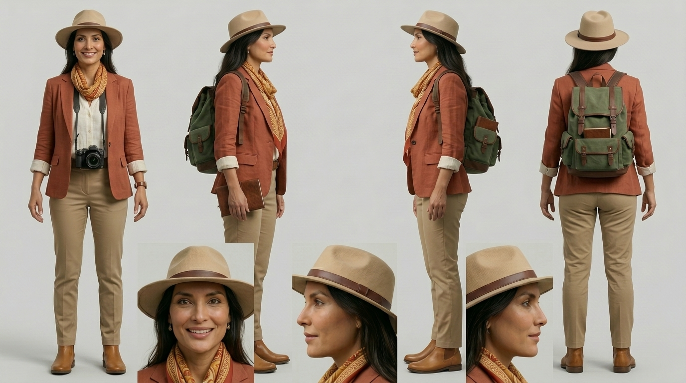

# FICHA OFICIAL DEL AVATAR — ELARA (presentadora del canal)

> Documento maestro de identidad visual de ELARA. Usar SIEMPRE esta descripción para
> mantener el avatar idéntico en miniaturas, intros y apariciones. Adjuntar la hoja de
> referencia de personaje al generador (Midjourney `--cref`, o "character reference").

---

## 📸 Imagen de referencia oficial


> Adjuntar SIEMPRE esta imagen al generador de IA para mantener el rostro y el vestuario
> idénticos en todas las miniaturas e intros. Archivo: `guiones/elara-avatar-referencia.jpg`

---

## 🧬 Descripción física
- Mujer latina, aprox. 40 años.
- Pelo largo, liso y oscuro (castaño muy oscuro / negro).
- Piel morena clara, rasgos cálidos, sonrisa amable y cercana.
- Expresión versátil: curiosa y didáctica en calma; de asombro/tensión en escenas dramáticas.

## 👗 Vestuario — VARIABLE POR GUION
> IMPORTANTE: Elara usa un VESTUARIO DISTINTO en cada video, adaptado al tema y al clima
> de la época. Lo único fijo es su ROSTRO y su esencia. Ver los vestuarios concretos en
> **`elara-vestuarios-por-guion.md`**.

- Look de referencia original (imagen base): sombrero explorador beige, blazer terracota,
  blusa blanca, pañuelo mostaza, pantalón caqui, botas marrón, mochila verde, cámara vintage.
  → Sirve solo como referencia de CARA; el vestuario cambia en cada guion.
- Estilo general: siempre "exploradora / historiadora moderna" (nunca ropa de época histórica).

## 🎙️ Voz
- Elara habla SIEMPRE con **voz latinoamericana** (español latino neutro).
- Aplica a la narración (voz en off) y a los clips donde habla a cámara / lip-sync en Flow.

## 🎭 Personalidad / rol
- Es la **presentadora MODERNA** del canal (historiadora-exploradora tipo documentalista).
- NO es un personaje dentro de la época histórica: nunca se viste de romana, egipcia, etc.
- Fórmula: ELara en primer plano + el mundo histórico detrás ("yo te llevo a este lugar").
- Tono: cercano, curioso, cinematográfico. Habla en primera persona ("Soy Elara...").

---

## 🧾 PROMPT MAESTRO (para generar a ELARA de forma consistente)
```
Historiadora exploradora latina de unos 40 años, pelo largo oscuro liso, sombrero de
explorador beige con cinta de cuero marrón, blazer terracota sobre blusa blanca, pañuelo
mostaza estampado al cuello, pantalón caqui, botas de cuero marrón. Fotorrealismo
cinematográfico 8K, iluminación de cine.
[NEGATIVO: sin ropa de época histórica, sin anacronismos, sin rostros ni manos deformes,
sin texto, sin logos, sin marcas de agua.]
```

---

## 🖼️ PLANTILLA de miniatura con ELARA (imagen base, SIN texto)
```
Miniatura cinematográfica de YouTube. En primer plano a un lado, ELARA (historiadora
exploradora latina de ~40 años: pelo largo oscuro, sombrero beige con cinta marrón, blazer
terracota, pañuelo mostaza). Expresión de [EMOCIÓN: asombro/tensión/misterio], rostro
iluminado por [FUENTE DE LUZ del tema]. Al otro lado y de fondo, [ESCENA HISTÓRICA DEL VIDEO].
Composición de póster de Hollywood, altísimo contraste, [PALETA DE COLOR]. ELara es el punto focal.
[NEGATIVO: sin ropa antigua en ELara, sin texto, sin logos, sin marcas de agua, sin rostros
ni manos deformes, sin gore, sin anacronismos.]
```

### Ejemplo aplicado a POMPEYA
- EMOCIÓN: asombro y tensión.
- FUENTE DE LUZ: resplandor naranja del fuego.
- ESCENA HISTÓRICA: el Vesubio en erupción y Pompeya ardiendo bajo lluvia de ceniza, año 79 d.C.
- PALETA: naranja / negro / dorado.
- Texto en CapCut: **¿HUIR O QUEDARSE?** (dorado #E8C87E, fuente Cinzel) + logo ELARA.

---

## ✅ Reglas de consistencia
1. El ROSTRO y la esencia de Elara son SIEMPRE los mismos (mujer latina ~40, pelo largo
   oscuro, mirada cálida) → eso la hace reconocible.
2. El VESTUARIO CAMBIA en cada guion según el tema (ver `elara-vestuarios-por-guion.md`).
3. ELara siempre moderna; el fondo/época cambia según el video. Nunca ropa histórica.
4. Miniatura: 1280x720, <2MB, texto de 2-3 palabras, sin taparle los ojos.
